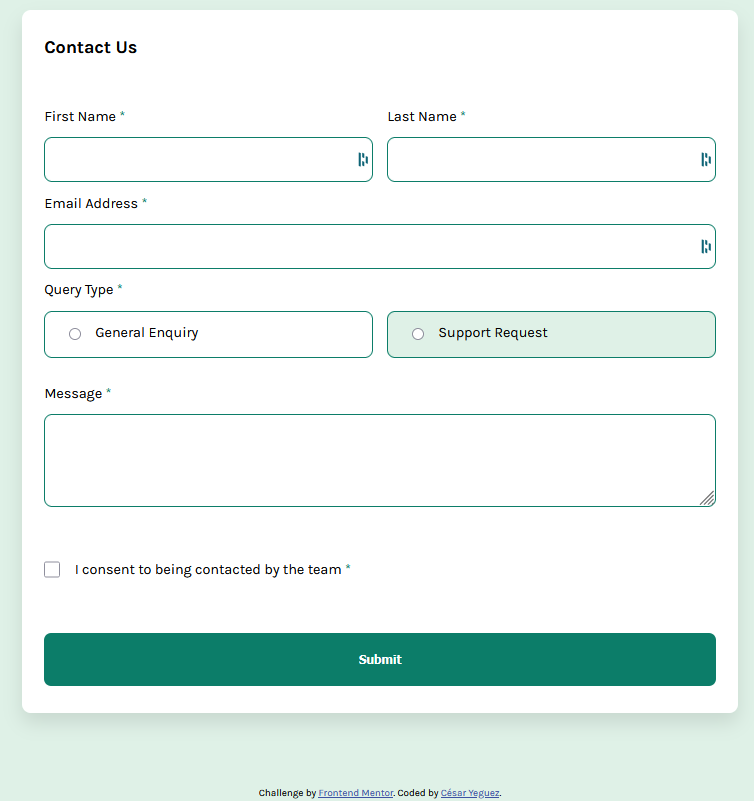
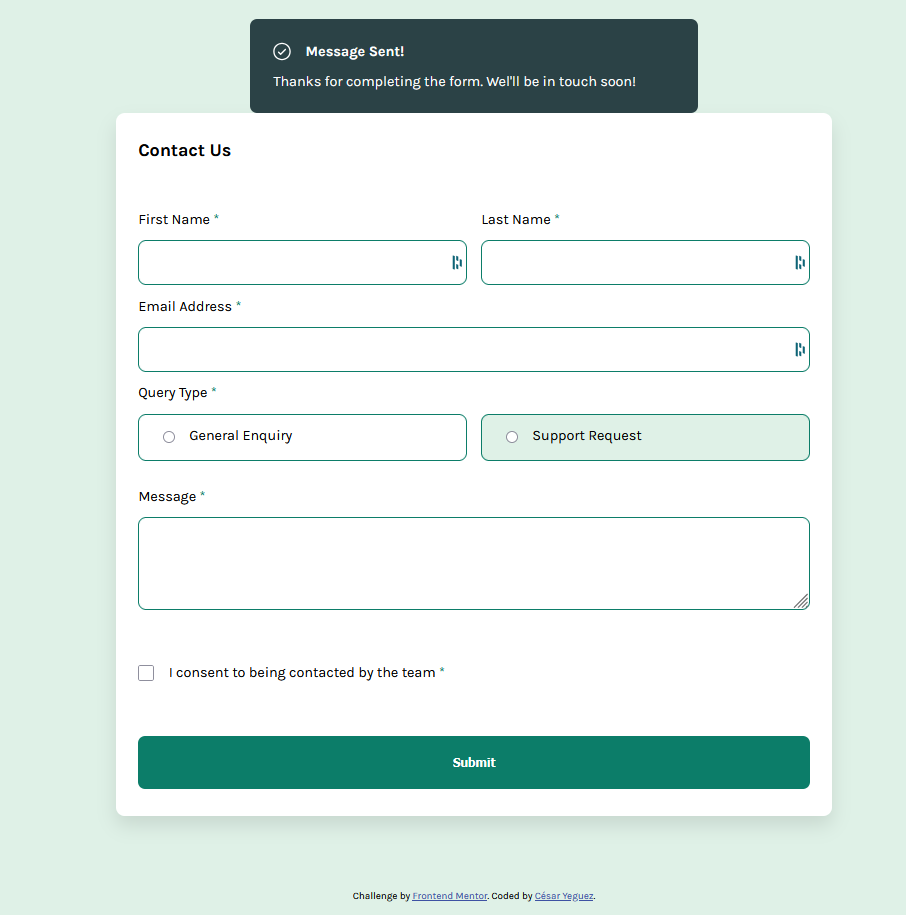
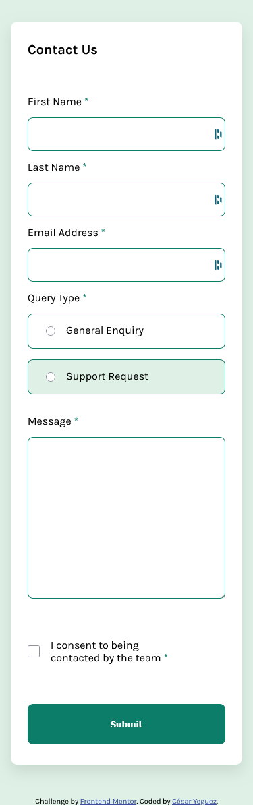
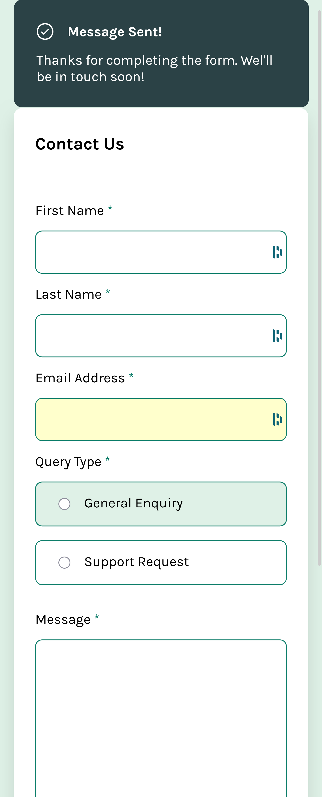

# Frontend Mentor - Contact form solution

This is a solution to the [Contact form challenge on Frontend Mentor](https://www.frontendmentor.io/challenges/contact-form--G-hYlqKJj). Frontend Mentor challenges help you improve your coding skills by building realistic projects.

## Table of contents

- [Overview](#overview)
  - [The challenge](#the-challenge)
  - [Screenshot](#screenshot)
  - [Links](#links)
- [My process](#my-process)
  - [Built with](#built-with)
  - [What I learned](#what-i-learned)  
- [Author](#author)


**Note: Delete this note and update the table of contents based on what sections you keep.**

## Overview

### The challenge

Users should be able to:

- Complete the form and see a success toast message upon successful submission
- Receive form validation messages if:
  - A required field has been missed
  - The email address is not formatted correctly
- Complete the form only using their keyboard
- Have inputs, error messages, and the success message announced on their screen reader
- View the optimal layout for the interface depending on their device's screen size
- See hover and focus states for all interactive elements on the page

### Screenshot






### Links

- Solution URL: [Add solution URL here](https://github.com/cyeguez/contact-form-main)
- Live Site URL: [Add live site URL here](https://contact-form-challenge2025.netlify.app/)

## My process

- I configure the project architecture . 🏛️
- I clean the HTML of Comments and styles. 🧹
- I assign the HTML tags. 🎯
- I write the styles, I configure mediaquerys. 🕶️
- I create the logical part in JS. 🧠

### Built with


### What I learned
-  Using literal expressions to validate form fields


```js
function validateField(field, expRegex, errorElement, message) {
  if (field.value.match(expRegex)) {
    hiddenError(field, errorElement);
    return true;
  } else {
    showError(field, errorElement, message);
  }
  return false;
}
```


## Author

- Website - [Cesar Yeguez](https://app.netlify.com/sites/cesaryeguezporfolio/overview)
- Frontend Mentor - [@cyeguez](https://www.frontendmentor.io/profile/cyeguez)

